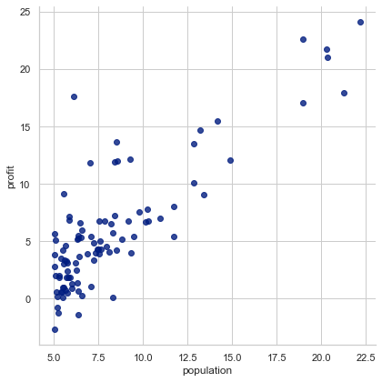
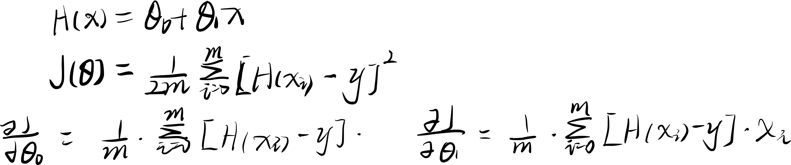
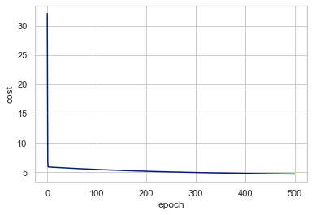
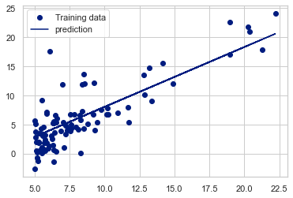

导入pandas包用于处理数据<br>
导入seborn和pyplot包用于画图<br>
tensorflow包提供placeholder占位符


```python
import pandas as pd
import seaborn as sns
sns.set(context="notebook", style="whitegrid", palette="dark")
import matplotlib.pyplot as plt
import tensorflow as tf
import numpy as np
```

这里定义为人口和利润


```python
df = pd.read_csv('ex1data1.txt', names=['population','profit'])
```


```python
df.head()
```


<div>
<style scoped>
    .dataframe tbody tr th:only-of-type {
        vertical-align: middle;
    }

    .dataframe tbody tr th {
        vertical-align: top;
    }
    
    .dataframe thead th {
        text-align: right;
    }
</style>
<table border="1" class="dataframe">
  <thead>
    <tr style="text-align: right;">
      <th></th>
      <th>population</th>
      <th>profit</th>
    </tr>
  </thead>
  <tbody>
    <tr>
      <th>0</th>
      <td>6.1101</td>
      <td>17.5920</td>
    </tr>
    <tr>
      <th>1</th>
      <td>5.5277</td>
      <td>9.1302</td>
    </tr>
    <tr>
      <th>2</th>
      <td>8.5186</td>
      <td>13.6620</td>
    </tr>
    <tr>
      <th>3</th>
      <td>7.0032</td>
      <td>11.8540</td>
    </tr>
    <tr>
      <th>4</th>
      <td>5.8598</td>
      <td>6.8233</td>
    </tr>
  </tbody>
</table>
</div>


```python
df.info()
```

    <class 'pandas.core.frame.DataFrame'>
    RangeIndex: 97 entries, 0 to 96
    Data columns (total 2 columns):
     #   Column      Non-Null Count  Dtype  
    ---  ------      --------------  -----  
     0   population  97 non-null     float64
     1   profit      97 non-null     float64
    dtypes: float64(2)
    memory usage: 1.6 KB


lmplot绘制出散点图


```python
sns.lmplot(x='population', y='profit',data=df, height=6, fit_reg=False)
plt.show()
```


​    

​    


get_X函数
创建ones（dataframe类型）m行1列的1元素，并将ones这一列与传入的df合并，传出
类似 1,a
    1,b
    1,c
<br>
get_Y函数获取最后一列数据[a,b,c]

normalize_feature函数将传入的df全部按列归一化方便后续梯度下降


```python
def get_X(df):#读取特征
    ones = pd.DataFrame({'ones':np.ones(len(df))})#ones是和pf等高的1元素
    data = pd.concat([ones,df], axis=1)#拼接ones和pd为data
    return data.iloc[:,:-1].values
def get_Y(df):#读取标签
    return np.array(df.iloc[:, -1])#获取df最后一列

def normalize_feature(df):#特征缩放，与平均数的差值/方差
    return df.apply(lambda column:(column - column.mean()) / column.std())
```

linear_regression函数进行梯度下降<br>


```python
def linear_regression(X_data,y_data, alpha,epoch,optimizer=tf.compat.v1.train.GradientDescentOptimizer):
    #放数据的graph
    X = tf.placeholder(tf.float32, shape = X_data.shape)
    y = tf.placeholder(tf.float32, shape = y_data.shape)
    
    with tf.varialbe_scope('liner-regression'):
        W = tf.get_variable("weights",
                           shape=(X_data.shape[1],1),#2行1列
                           initializer=tf.constant_initializer()) #n*1
        y_pred = tf.matmul(X, W) #m*n的矩阵乘 n*1 ->m*1矩阵
        # (m*1)T*(m*1) = 1*1
        #transpose_a/b说明矩阵a/b的转置
        #loss就是梯度下降中的代价函数J(θ)
        loss = 1/ (2 * len(X_data)) *tf.matmul((y_pred -y), (y_pred - y), transpose_a=True) 
    opt = optimizer(learning_rate=alpha)
    opt_operation = opt.minimize(loss)
    
    #run session
    with tf.Session() as sess:
        sess.run(tf.global_variables_initializer())
        sess_data = []
        for i in range(epoch):
            _, loss_val,W_val = sess.run([opt_operation, loss, W], feed_dict = {X:X_data, y:y_data})
            loss_data.append(loss_val[0,0]) #损失函数都是1*1矩阵
            
            if len(loss_data)>1 and np.abs(loss_data[-1] - loss_data[-2])<10 ** -9:
                print('Converged at epoch {}'.format(i))
                break
                
    #清除 graph
    tf.reset_default_gragh()
    return {'loss':loss_data, 'parameters': W_val}
```


```python
data = pd.read_csv('ex1data1.txt', names=['population', 'profit'])

data.head()
```


<div>
<style scoped>
    .dataframe tbody tr th:only-of-type {
        vertical-align: middle;
    }

    .dataframe tbody tr th {
        vertical-align: top;
    }
    
    .dataframe thead th {
        text-align: right;
    }
</style>
<table border="1" class="dataframe">
  <thead>
    <tr style="text-align: right;">
      <th></th>
      <th>population</th>
      <th>profit</th>
    </tr>
  </thead>
  <tbody>
    <tr>
      <th>0</th>
      <td>6.1101</td>
      <td>17.5920</td>
    </tr>
    <tr>
      <th>1</th>
      <td>5.5277</td>
      <td>9.1302</td>
    </tr>
    <tr>
      <th>2</th>
      <td>8.5186</td>
      <td>13.6620</td>
    </tr>
    <tr>
      <th>3</th>
      <td>7.0032</td>
      <td>11.8540</td>
    </tr>
    <tr>
      <th>4</th>
      <td>5.8598</td>
      <td>6.8233</td>
    </tr>
  </tbody>
</table>
</div>


```python
X = get_X(data)
print(X.shape,type(X))

y = get_Y(data)
print(y.shape, type(y))
```

    (97, 2) <class 'numpy.ndarray'>
    (97,) <class 'numpy.ndarray'>


```python
theta = np.zeros(X.shape[1])#X有两列，shape[0]表行数，shpae[1]=2是两列

```

lr_cost函数传入θ，样本里的x和y（需要拟合的值）<br>
定义m为样本数<br>
线性拟合函数最初始参数为θ0=0，θ1=0，h(x) = θ0+θ1x <br>
用x计算出的值h(x)-y(x)为差值，函数中的inner即为差值数组<br>
因为损失函数为差值平方的和/2m<br>
直接对差值矩阵inner乘其转置矩阵得差值平方的和


```python
def lr_cost(theta, X, y):
#     X:R(m*n) ,m样本数，n 特征数
#     y：R(m)
#     theta:R(n) ,线性回归参数
    m = X.shape[0] #m样本数
    inner = X @ theta - y #R(m*1) ,X @ theta 等价于X.dot(theta)也即是矩阵乘法
    
    square_sum = inner.T @ inner
    cost = square_sum / (2 * m)
    
    return cost
```


```python
lr_cost(theta, X, y)#返回损失函数的值
```


    32.072733877455676


批量梯度下降函数（每一次梯度下降的过程中，都用到了所有样本，也就是所有的x，y）<br>
对于θ0θ1求偏导，式子为 <br>



```python
def gradient(theta, X, y):
    m = X.shape[0]
    
    inner = X.T @ (X @ theta - y) 
    i
    return inner / m
```

    [ -5.83913505 -65.32884975]


拟合线性回归，返回最后的两个参数θ0和θ1<br>
_theta拷贝原来的theta<br>
在epoch范围内循环执行梯度下降，并将损失函数添加到cost_data数组中<br>


```python
def batch_gradient_decent(theta, X, y, epoch, alpha=0.01):
#     拟合线性回归，返回参数和代价
    cost_data = [lr_cost(theta, X, y)]
    _theta = theta.copy() #备份的theta
    for _ in range(epoch):
        _theta = _theta - alpha * gradient(_theta, X, y)
        cost_data.append(lr_cost(_theta, X, y))
    return _theta, cost_data
```


```python
epoch = 500
final_theta, cost_data = batch_gradient_decent(theta, X, y, epoch)
```


```python
final_theta
```


    array([-2.28286727,  1.03099898])


```python
cost_data
```


    [32.072733877455676,
     6.737190464870011,
     5.931593568604956,
     5.901154707081388,
     5.895228586444221,
     5.890094943117332,
     5.885004158443646,
     5.8799324804914175,
     5.874879094762575,
     5.869843911806386,
     5.864826865312929,
     5.859827889932181,
     5.85484692057229,
     5.849883892376587,
     5.844938740722034,
     5.840011401218361,
     5.8351018097072265,
     5.830209902261388,
     5.825335615183862,
     5.820478885007098,
     5.815639648492155,
     5.810817842627869,
     5.806013404630045,
     5.80122627194063,
     5.796456382226899,
     5.791703673380653,
     5.7869680835173956,
     5.782249550975539,
     5.777548014315596,
     5.772863412319382,
     5.768195683989214,
     5.76354476854712,
     5.758910605434049,
     5.754293134309077,
     5.749692295048629,
     5.745108027745684,
     5.740540272709012,
     5.735988970462381,
     5.731454061743792,
     5.726935487504702,
     5.722433188909257,
     5.717947107333529,
     5.71347718436475,
     5.709023361800549,
     5.704585581648199,
     5.700163786123856,
     5.695757917651815,
     5.691367918863752,
     5.686993732597982,
     5.682635301898707,
     5.678292570015291,
     5.673965480401506,
     5.669653976714797,
     5.665358002815553,
     5.661077502766381,
     5.6568124208313595,
     5.652562701475333,
     5.648328289363181,
     5.644109129359092,
     5.639905166525856,
     5.635716346124135,
     5.631542613611772,
     5.627383914643055,
     5.623240195068027,
     5.619111400931778,
     5.61499747847374,
     5.610898374126984,
     5.606814034517532,
     5.602744406463646,
     5.598689436975159,
     5.59464907325276,
     5.590623262687323,
     5.586611952859217,
     5.5826150915376225,
     5.578632626679853,
     5.574664506430678,
     5.570710679121643,
     5.566771093270403,
     5.562845697580051,
     5.558934440938442,
     5.555037272417543,
     5.551154141272754,
     5.547284996942256,
     5.543429789046352,
     5.539588467386808,
     5.535760981946204,
     5.531947282887275,
     5.5281473205522715,
     5.524361045462306,
     5.520588408316713,
     5.5168293599924025,
     5.513083851543225,
     5.5093518341993315,
     5.505633259366538,
     5.501928078625699,
     5.498236243732065,
     5.494557706614666,
     5.490892419375677,
     5.487240334289805,
     5.483601403803652,
     5.479975580535111,
     5.476362817272741,
     5.472763066975153,
     5.469176282770398,
     5.465602417955358,
     5.462041425995138,
     5.4584932605224585,
     5.454957875337047,
     5.451435224405051,
     5.447925261858424,
     5.444427941994333,
     5.440943219274565,
     5.437471048324933,
     5.434011383934687,
     5.430564181055919,
     5.427129394802987,
     5.423706980451917,
     5.420296893439839,
     5.416899089364382,
     5.413513523983123,
     5.4101401532129865,
     5.406778933129694,
     5.403429819967165,
     5.400092770116975,
     5.396767740127768,
     5.393454686704697,
     5.390153566708862,
     5.386864337156747,
     5.383586955219661,
     5.380321378223178,
     5.377067563646582,
     5.373825469122317,
     5.37059505243543,
     5.367376271523024,
     5.364169084473712,
     5.360973449527068,
     5.357789325073084,
     5.354616669651632,
     5.3514554419519165,
     5.348305600811943,
     5.345167105217981,
     5.342039914304029,
     5.338923987351282,
     5.335819283787603,
     5.332725763186989,
     5.329643385269053,
     5.326572109898499,
     5.323511897084587,
     5.32046270698063,
     5.317424499883461,
     5.314397236232924,
     5.311380876611356,
     5.3083753817430726,
     5.305380712493861,
     5.302396829870465,
     5.2994236950200815,
     5.296461269229852,
     5.29350951392636,
     5.290568390675129,
     5.287637861180118,
     5.284717887283232,
     5.281808430963811,
     5.278909454338152,
     5.276020919659001,
     5.27314278931507,
     5.270275025830544,
     5.267417591864592,
     5.264570450210885,
     5.261733563797111,
     5.2589068956844836,
     5.256090409067274,
     5.253284067272322,
     5.250487833758565,
     5.2477016721165555,
     5.244925546067994,
     5.242159419465253,
     5.239403256290902,
     5.236657020657251,
     5.2339206768058695,
     5.231194189107128,
     5.228477522059737,
     5.225770640290271,
     5.223073508552729,
     5.220386091728056,
     5.217708354823697,
     5.215040262973137,
     5.21238178143545,
     5.2097328755948435,
     5.207093510960208,
     5.204463653164672,
     5.20184326796515,
     5.199232321241896,
     5.1966307789980615,
     5.19403860735926,
     5.191455772573107,
     5.188882241008802,
     5.1863179791566765,
     5.18376295362776,
     5.181217131153349,
     5.1786804785845755,
     5.176152962891967,
     5.173634551165023,
     5.171125210611782,
     5.168624908558404,
     5.166133612448731,
     5.163651289843875,
     5.161177908421789,
     5.15871343597685,
     5.156257840419433,
     5.153811089775505,
     5.151373152186197,
     5.148943995907395,
     5.146523589309324,
     5.14411190087614,
     5.141708899205515,
     5.139314553008234,
     5.136928831107778,
     5.134551702439931,
     5.132183136052365,
     5.129823101104238,
     5.127471566865799,
     5.12512850271798,
     5.122793878152007,
     5.120467662768992,
     5.118149826279543,
     5.115840338503368,
     5.113539169368884,
     5.111246288912825,
     5.108961667279847,
     5.10668527472215,
     5.104417081599077,
     5.1021570583767355,
     5.099905175627619,
     5.097661404030211,
     5.095425714368609,
     5.09319807753215,
     5.090978464515022,
     5.088766846415887,
     5.086563194437517,
     5.0843674798864,
     5.082179674172386,
     5.079999748808298,
     5.0778276754095675,
     5.075663425693873,
     5.0735069714807555,
     5.071358284691268,
     5.069217337347596,
     5.067084101572705,
     5.064958549589969,
     5.062840653722809,
     5.060730386394342,
     5.05862772012701,
     5.056532627542231,
     5.0544450813600355,
     5.052365054398719,
     5.050292519574479,
     5.0482274499010735,
     5.046169818489457,
     5.044119598547441,
     5.042076763379342,
     5.040041286385627,
     5.038013141062576,
     5.035992301001939,
     5.033978739890578,
     5.031972431510141,
     5.029973349736707,
     5.027981468540455,
     5.025996761985323,
     5.024019204228667,
     5.022048769520928,
     5.020085432205293,
     5.018129166717368,
     5.016179947584834,
     5.014237749427129,
     5.012302546955105,
     5.010374314970709,
     5.008453028366643,
     5.006538662126048,
     5.004631191322175,
     5.00273059111806,
     5.0008368367662,
     4.998949903608226,
     4.997069767074595,
     4.995196402684257,
     4.9933297860443435,
     4.991469892849845,
     4.9896166988833,
     4.987770180014478,
     4.98593031220006,
     4.984097071483333,
     4.982270433993871,
     4.9804503759472345,
     4.978636873644648,
     4.9768299034727,
     4.975029441903031,
     4.973235465492034,
     4.97144795088054,
     4.969666874793522,
     4.967892214039784,
     4.966123945511668,
     4.964362046184744,
     4.962606493117519,
     4.96085726345113,
     4.959114334409053,
     4.957377683296804,
     4.95564728750164,
     4.95392312449227,
     4.9522051718185605,
     4.95049340711124,
     4.948787808081611,
     4.9470883525212574,
     4.94539501830176,
     4.943707783374398,
     4.942026625769876,
     4.9403515235980295,
     4.938682455047536,
     4.937019398385641,
     4.935362331957869,
     4.933711234187743,
     4.932066083576499,
     4.930426858702819,
     4.928793538222535,
     4.927166100868363,
     4.925544525449622,
     4.923928790851963,
     4.922318876037079,
     4.920714760042452,
     4.919116421981068,
     4.91752384104114,
     4.915936996485852,
     4.914355867653076,
     4.912780433955112,
     4.911210674878409,
     4.9096465699833125,
     4.908088098903785,
     4.9065352413471475,
     4.904987977093815,
     4.903446285997032,
     4.90191014798261,
     4.9003795430486665,
     4.898854451265366,
     4.897334852774656,
     4.895820727790016,
     4.894312056596192,
     4.892808819548943,
     4.891310997074789,
     4.889818569670748,
     4.888331517904091,
     4.8868498224120795,
     4.8853734639017246,
     4.883902423149524,
     4.88243668100122,
     4.880976218371548,
     4.879521016243985,
     4.8780710556705085,
     4.876626317771341,
     4.875186783734714,
     4.87375243481661,
     4.872323252340535,
     4.870899217697262,
     4.869480312344594,
     4.868066517807122,
     4.866657815675986,
     4.865254187608633,
     4.863855615328574,
     4.862462080625159,
     4.861073565353324,
     4.859690051433372,
     4.858311520850715,
     4.856937955655664,
     4.855569337963178,
     4.85420564995264,
     4.852846873867616,
     4.851492992015639,
     4.850143986767962,
     4.8487998405593355,
     4.847460535887784,
     4.84612605531437,
     4.8447963814629675,
     4.843471497020046,
     4.842151384734428,
     4.8408360274170805,
     4.839525407940883,
     4.838219509240404,
     4.836918314311682,
     4.8356218062120035,
     4.834329968059677,
     4.833042783033826,
     4.831760234374157,
     4.830482305380745,
     4.829208979413817,
     4.8279402398935405,
     4.826676070299799,
     4.825416454171979,
     4.824161375108761,
     4.822910816767899,
     4.821664762866011,
     4.8204231971783695,
     4.819186103538688,
     4.817953465838902,
     4.816725268028978,
     4.815501494116686,
     4.814282128167403,
     4.813067154303901,
     4.811856556706141,
     4.810650319611066,
     4.809448427312395,
     4.808250864160425,
     4.807057614561818,
     4.805868662979403,
     4.804683993931976,
     4.80350359199409,
     4.802327441795867,
     4.80115552802278,
     4.799987835415476,
     4.798824348769555,
     4.7976650529353915,
     4.796509932817919,
     4.795358973376449,
     4.7942121596244665,
     4.793069476629436,
     4.791930909512613,
     4.790796443448837,
     4.789666063666355,
     4.788539755446615,
     4.787417504124084,
     4.786299295086054,
     4.785185113772448,
     4.784074945675635,
     4.7829687763402395,
     4.781866591362954,
     4.78076837639235,
     4.779674117128696,
     4.778583799323759,
     4.777497408780635,
     4.776414931353551,
     4.775336352947692,
     4.774261659519006,
     4.773190837074032,
     4.772123871669708,
     4.771060749413196,
     4.770001456461701,
     4.768945979022286,
     4.767894303351698,
     4.766846415756183,
     4.765802302591315,
     4.764761950261813,
     4.763725345221363,
     4.762692473972447,
     4.761663323066164,
     4.760637879102053,
     4.7596161287279255,
     4.75859805863968,
     4.757583655581141,
     4.7565729063438775,
     4.755565797767039,
     4.7545623167371724,
     4.753562450188067,
     4.752566185100569,
     4.751573508502425,
     4.750584407468098,
     4.7495988691186195,
     4.7486168806214,
     4.7476384291900775,
     4.746663502084345,
     4.745692086609786,
     4.744724170117705,
     4.743759740004973,
     4.742798783713851,
     4.741841288731832,
     4.740887242591483,
     4.739936632870274,
     4.738989447190423,
     4.7380456732187275,
     4.737105298666416,
     4.736168311288972,
     4.735234698885989,
     4.734304449301005,
     4.733377550421341,
     4.732453990177952,
     4.731533756545262,
     4.73061683754101,
     4.7297032212260985,
     4.728792895704427,
     4.727885849122751,
     4.726982069670518,
     4.726081545579717,
     4.725184265124721,
     4.724290216622143,
     4.7233993884306775,
     4.722511768950946,
     4.721627346625359,
     4.7207461099379495,
     4.7198680474142325,
     4.718993147621053,
     4.7181213991664395,
     4.717252790699452,
     4.716387310910036,
     4.715524948528874,
     4.7146656923272445,
     4.713809531116866]


```python
lr_cost(final_theta, X, y)
```


    4.713809531116866


```python
c = {'epoch':list(range(epoch+1)),'cost':cost_data}
cost_df = pd.DataFrame(c)
ax = sns.lineplot(x='epoch',y='cost',data = cost_df)
plt.show()
```



    


```python
b = final_theta[0] #intercept,Y轴上的截距
m = final_theta[1] # slope ，斜率
print('fx = ')
plt.scatter(data.population,data.profit, label="Training data")
plt.plot(data.population, data.population*m + b,label="prediction")
plt.legend(loc=2)
plt.show()
```


​    

​    

